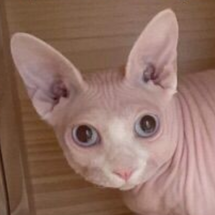

    

<h2 align="center">
    This project is currently in development! 
</h2>
<h4 align="center">
    If you would like to be notified when we commit, please watch this repository
</h4>

## 😎 About

bot21.py is an open-source Discord bot with the goal of providing essential tools for dank server administrators to run their Discord server!

If you want to try it out by yourself, feel free to invite it to your Discord server by clicking [Here](https://discord.com/api/oauth2/authorize?client_id=1017155792048230520&permissions=8&scope=bot)!

## ⌨ Planned Features
- Music Player
- Moderation Tools
- Fun Commands

## 🐑 Contributing
I appreciate all forms of feedback, bug reports or contributions. See [issues page](https://github.com/Twm757/discord-bot/issues) to find out what you could do!

Many thanks for any assistance given.

## 👑 Project Owner 
A link to my GitHub profile can be found below:

- [Twm](https://github.com/Twm757)

## 📜 Requirements
These are the requirements for the bot.

- [Python 3.10](https://www.python.org/downloads) (Required packages listed in requirements.txt)
- More to come.

## 💖 Credits
Below is everyone who has helped me with the project:

- JustEat
- UberEats
- Deliveroo